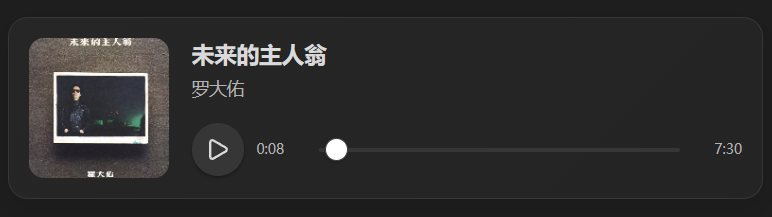

# Knowledge Objects

Knowledge Objects renders semantic objects stored in Markdown as interactive components in Obsidian.

The initial release supports local music objects.

## Features

- Render `music` fenced code blocks as audio players
- Display title, artist, cover image, progress, and duration
- Support local audio and image files stored inside the vault
- Work on desktop and mobile
- Preserve readable Markdown when the plugin is unavailable

## Usage

Create a fenced `music` block:

```music
title: Rising Force
artist: Yngwie Malmsteen
src: Assets/music/rising-force.mp3
cover: Assets/images/rising-force.jpg
```

Both `src` and `cover` use vault-relative paths.

## Requirements

- Audio files must be stored inside the Obsidian vault
- Cover images must be stored inside the Obsidian vault
- Paths must use vault-relative paths rather than operating-system absolute paths

## Installation

### Community plugins

Once the plugin is available in the Obsidian Community Plugins directory:

1. Open Obsidian Settings.
2. Open Community plugins.
3. Search for `Knowledge Objects`.
4. Install and enable it.

### Manual installation

Download the following files from the latest GitHub release:

- `main.js`
- `manifest.json`
- `styles.css`

Place them in:

```text
<Vault>/.obsidian/plugins/knowledge-objects/
```

Then restart Obsidian and enable the plugin.

## Roadmap

Future versions may support additional semantic objects such as papers, repositories, books, movies, and games.

## License

MIT